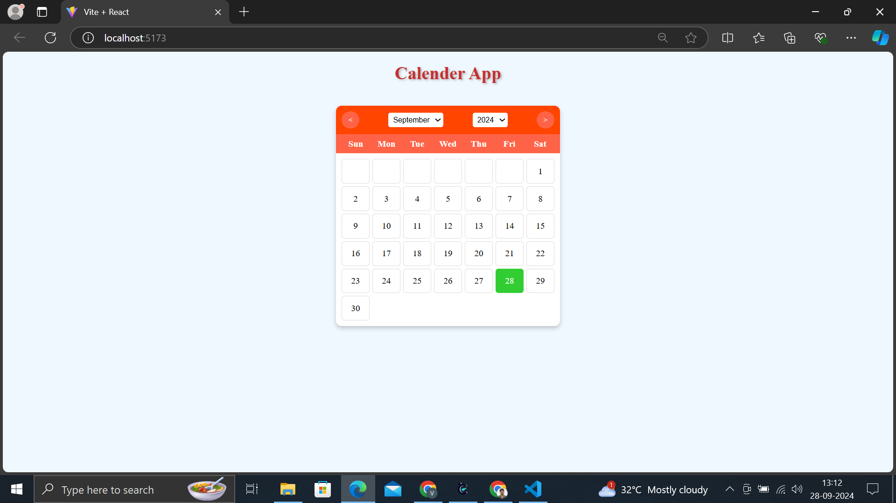

# 📅 Calendar App

## 📸 Screenshots

<div style="text-align: center;">
  
</div>


## 📚 Table of Contents
- [Project Overview](#project-overview)
- [Technologies Used](#technologies-used)
- [Features](#features)
- [Installation](#installation)
- [Usage](#usage)
- [Screenshots](#screenshots)
- [Contributing](#contributing)
- [License](#license)

## 📝 Project Overview
The Calendar App is a fully responsive web application that allows users to view and interact with a calendar. The app highlights the current date in green, and users can hover over any day to see it change to pink. The calendar can be navigated by year, month, or day, providing a comprehensive view of the dates.

## ⚙️ Technologies Used
- **Frontend**:
  - React
  - CSS
  - HTML

## 🌟 Features
- **Responsive Design**: The calendar is fully responsive, ensuring a seamless experience across different devices and screen sizes.
- **Current Date Highlight**: The current date is highlighted in green for easy identification.
- **Hover Effects**: Users can hover over any day, and it will change to pink, enhancing interactivity.
- **Navigation Options**: Users can switch views between year, month, and day.
- **User-Friendly Interface**: Clean and modern design for easy navigation and interaction.

## 📦 Installation
To run this project locally, follow these steps:

1. **Clone the repository**:
   ```bash
   git clone https://github.com/RVJVIJAY/calenderapp.git
2.**Navigate to the project directory:**

     cd calender
3.**Install dependencies using npm or yarn:**

    npm install
4.**Start the development server:**

    npm start
5.**Open the app in your browser:**

    Once the development server is running, open http://localhost:3000 to view the application in your browser.


🤝 Contributing
Contributions are welcome! Please follow these steps:

1.Fork the repository.
2.Create a new branch (git checkout -b feature/YourFeature).
3.Make your changes and commit them (git commit -m 'Add your feature').
4.Push to the branch (git push origin feature/YourFeature).
5.Create a pull request.


### Icons Explained:
- 📅 (Calendar) - Represents the app's main purpose.
- 📚 (Book) - Denotes the table of contents.
- 📝 (Memo) - Indicates the project overview.
- ⚙️ (Gear) - Refers to the technologies used.
- 🌟 (Star) - Highlights the features of the app.
- 📦 (Package) - Refers to the installation instructions.
- 🚀 (Rocket) - Indicates how to use the app.
- 📸 (Camera) - Represents the screenshot section.
- 🤝 (Handshake) - Refers to contributing to the project.


This version enhances the visual appeal of your README file, making it easier to read and navigate. Let me know if you need any more modifications!
